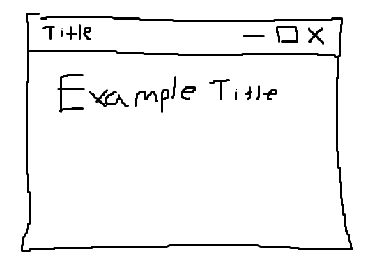
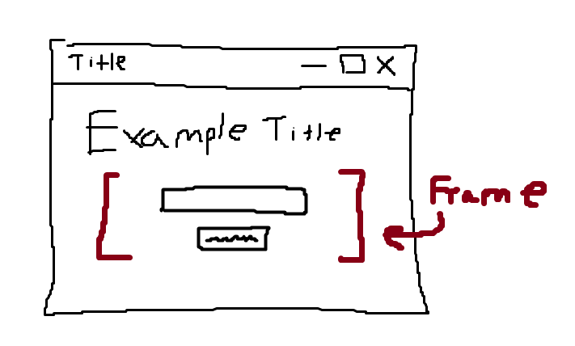
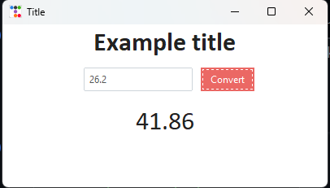

# Tkinter 


### Main components of Tkinter:
 Widgets : Adds functionality to your project \
 Layout  : Shows how the window is laid out \
 Style   : Determines color, font, background, etc...

 Once we understand these three, we can build anything.

 ## Setting up a Tkinter Project

 ```python
 # ttk gives us all of the widgets we want to use, while tk gives us the logic
 import tkinter as tk
 from tkinter import ttk

 # window, where all of our hard work will be displayed
 window = tk.Tk()

 # run
window.mainloop()
 ```
This gives us our basic work environment. We initialize an window through the Tk() function and run the main logic using the mainloop() function.


### Sizing the Window
```python
window = tk.Tk()
window.title('Title')
window.geometry('400x200')
```

### Writing Text to the Window
Text in Tkinter is called a "label". \
We need our text to be inside of a container, and so far the only container we have is the main window.

```python
# master = window designates where the label will be contained
title_label = ttk.label(master = window, text = 'Example title', font = 'Calibri 24 bold')
title_label.pack()
```
The pack() function tells Tkinter to display the text, but there are other functions.



### Input Fields
If we want to add an input field with a button so that they appear next to eachother, we want to add them all to a larger container. 

```python
input_frame = ttk.Frame(master = window)
entry = ttk.Entry(master = input_frame)
button = ttk.Button(master = input_frame, text = 'Convert')
entry.pack(side = 'left', padx = 10)
button.pack(side = 'left')
input_frame.pack(pady = 10)
```
This effect is achieved by creating a frame to hold the elements, populating the frame with the widgets, and then putting the frame within the window. \
 

### Adding Functionality
If we want something to happen upon a button press, we need to define some logic.
```python
# We add a new command to the previous button widget to run a function when clicked. We only pass the name of the function as the command argument.
button = ttk.Button(
    master = input_frame, 
    text = 'Convert', 
    command = convert)
```
We want to take the entry used from the entry box as input for our button.
```python
entry_int = tk.IntVar() # Init's the variable as a tk int
entry = ttk.Entry(
    master = input_frame, 
    textvariable = entry_int) # Stores to entryInt

def convert():
    mile_input = entry_int.get()
    km_output = mile_input * 1.61
    output_string.set(km_output)
```

When we output:
```python
output_string = tk.StringVar()
output_label = ttk.Label(
    master = window, 
    text = 'Output', 
    font = 'Calibri 24', 
    textvariable = output_string)
output_label.pack(pady = 5)
```

Our finished demo would look like the following [Contained within the tkinterDemo1.py file]:


## Prettify
While our app works, it certainly doesn't look very pretty. We can use external libraries to make it look better.

```python
# from tkinter import ttk
import ttkbootstrap as ttk
```
We can either install it via Windows or Linux:
### Windows
```console
~$ pip install ttkbootstrap
```
Now that we have TTKBOOTSTRAP installed, we can replace the initial window with the ttkbootstrap version:
```python
window = ttk.Window(themename = 'journal')
```

