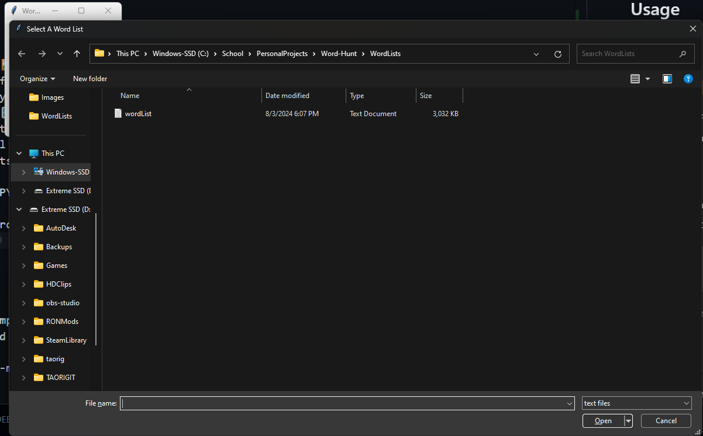

# Word Hunt Solver
If you find that you can't win at Word Hunt, no matter how hard you try, take this out for a spin. Just open up the GUI, type in the letters in the grid, and click "Generate Answers". 


## ⚠️IMPORTANT⚠️

* If you don't have all your words in your wordList.txt file as ALL CAPS, you WILL GET A SEGMENT FAULT. I should probably change this, but it would effect the time it takes to run and I really don't want to sit down and code anymore. I spent too long on this project...

* ON GOING BUG: On windows builds, you need to alt-tab out of the program and alt-tab back in or else you wont be able to input letters into the grid. 


## Usage
To run this program, simply run the PYGUI.exe executable, load the DEFAULT word list, type the letters into the grid, and click generate answers. 

### GUI 🖼️🖼️🖼️
The GUI interface is built using the Tkinter Python library, so having Python and Tkinter installed on your machine is a requirement for the program to run. 

All you have to do is run the PYGUI.py and a popup should show up to load a word list. This word list will be used to check generated words, and a default has already been provided in the "/WordLists" folder.
```console
~$ python3 .\PYGUI.py
```
Select the word list you want to use:


Then enter in the letters on the word grid and click "Generate Solutions".


### CLI 💲💲💲
On windows, all you have to do is run the wordHuntSolver.exe executable. Linux needs to run the command:
```console
~$ ./wordHuntSolver
```

When presented, type in the name of the wordList you want to use.

Next, type in the letters on the grid as they appear, from left to right, top to bottom.


## Compiling
Inorder to compile the program succesfully, I would reccommend using the cross-compiler on Linux to build for windows.
```console
~$ x86_64-w64-mingw32-gcc -o WordHunt.exe wordHuntSolver3.c
```

# FUTURE Updates
* Working on solving the Windows alt-tab bug.
* Making the GUI much more modern.
* Automatically switching to the next grid box after typign in the letter.
* Writing a better README.MD